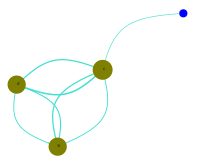

# JuliaCommunity
A julia wrapper for <a href='https://github.com/vtraag/leidenalg'>Leiden algorithm</a> (see the <a href='https://www.nature.com/articles/s41598-019-41695-z'>paper</a>) to discover and plot the communities of a network.

Leiden algorithm by both CPMVertexPartition (with a resolution parameter γ) and ModularityVertexPartition, as well as Louvain algorithm are implemented.

Technically, the wrapper serves well for huge networks/graphs, weighted or unweighted, directed or undirected, building on <a href='https://github.com/JuliaGraphs/SimpleWeightedGraphs.jl'>SimpleWeightedGraphs.jl</a>. An exponential process over negative node importances or edge weights is recommended during data preparation. 

The entire network/graph and the discovered communities can be plotted with the backend <a href='https://github.com/JuliaGraphs/GraphPlot.jl'>GraphPlot.jl</a>. When plotting the whole network, a graph with vertices no more than 5000 is encourgaged. Given a network/graph or a community, the plotting processing will first do a basic partition by ModularityVertexPartition-based Leiden algorithm to ensure 'closer' nodes are rendered with same random colors.

<a href='https://juliagraphs.org/LightGraphs.jl/latest/centrality/'>Centrality measures</a> of the nodes and the global cluster coefficients of the graph as well as the local cluster coefficients of the discovered communities could be assessed based on <a href='https://github.com/JuliaGraphs/LightGraphs.jl'>LightGraph.jl</a>.

More detailed documentation will be done soon.

NOTE: the leiden algorithm is implemented by the python package leidenalg, so
        before doing community discovery, Conda and PyCall have to be installed as
        follows:

            import Pkg
            Pkg.add("Conda")
            Pkg.add("PyCall")
            Pkg.build("PyCall")
            
            using Conda

            Conda.pip_interop(true)
            #Conda.pip("install", "scipy")
            #Conda.pip("install", "numpy")
            Conda.pip("install", "leidenalg")

 <b>A Demo</b>
<pre>
include("julia-community.jl")
using DataFrames

import .JuliaCommunity as juliac

nodes = DataFrame(id = [1,2,3,4,5,6,7,8,9,10], 
               label = ["a","b","c","d","e","f","g","h","i","j"], 
          importance = [1,5,6,5,5,4,3,3,2,2])
network = DataFrame(from = [1,2,2,2,3,3,4,4,4,5,5,5,6,6,8,8,10,10],
                      to = [3,3,4,9,2,4,2,3,7,3,6,7,5,8,5,6,7,9],
                  weight = [1,2,3,1,4,4,2,6,1,1,7,2,5,3,2,4,3,2])

#================================================================
create a JuliaCommunity instance.
task_series is used to name the processing data files (e.g., data/communities-$task_series.csv) and 
the svgs (e.g., fig/network-graph-$task_series.svg or fig/community-$(community_id)-$task_series.svg).
================================================================#
jc = juliac.JuliaCommunityInstance(network, nodes = nodes, node_label_field = "label", 
                                   node_weighted = true, to_summarise_graph = false, task_series = "demo")

#plot the entire network/graph
juliac.plot_network(jc, line_type="curve", node_size_smoother = 0.8, edge_width_smoother = 1.2)
</pre>

<pre>
#run louvain algorithm
#juliac.set_method(jc, jc.methods.louvain)

#run leiden algorithm
#juliac.set_method(jc, jc.methods.CPM)    #default
#juliac.set_method(jc, jc.methods.modularity)

#set the CPM γ for leiden algorithm
jc.γ = 0.1

#run community discovering
juliac.discover_communities(jc)

#print the communities discovered
println(jc.communities)

"""
3×2 DataFrame
 Row │ c      size  
     │ Int64  Int64 
─────┼──────────────
   1 │     1      4
   2 │     2      3
   3 │     3      3
"""

#print the memberships of the communities discovered
println(jc.memberships)

"""
10×2 DataFrame
 Row │ id     c     
     │ Int64  Int64 
─────┼──────────────
   1 │     1      1
   2 │     2      1
   3 │     3      1
   4 │     4      1
   5 │     5      2
   6 │     6      2
   7 │     7      3
   8 │     8      2
   9 │     9      3
  10 │    10      3
"""

#plot the first community
juliac.plot_community(jc, 1, line_type="curve")
</pre>

Contributor: Xiaoshan Nian(cen@njust.edu.cn). June, 2021
